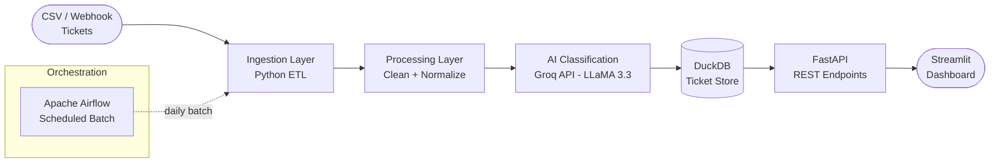

# Ticket Triage Pipeline

An AI-powered customer support ticket triage system that classifies, prioritizes, and summarizes incoming support tickets using LLMs. Built with a production-style data pipeline architecture combining Data Engineering and Generative AI.

---

## Architecture



---

## Features

- **Ingest** tickets from CSV files or webhook payloads
- **Clean & normalize** ticket fields (subject, body, category, urgency)
- **AI Classification** using Groq API (LLaMA 3.3):
  - Category: `billing` / `bug` / `feature_request` / `account_issue`
  - Priority: `HIGH` / `MEDIUM` / `LOW`
  - Auto-generated 2-line summary for support agents
- **Duplicate detection** — flags similar tickets
- **Status tracking** — `new` → `in_review` → `assigned` → `resolved`
- **FastAPI endpoints** for triage, lookup, and status updates
- **Streamlit dashboard** for real-time ticket visibility
- **Airflow DAG** for scheduled batch processing
- **Centralized logging** for ingestion, classification, and API errors

---

## Tech Stack

| Layer | Technology |
|---|---|
| Ingestion | Python, CSV, REST Webhooks |
| AI Classification | Groq API, LLaMA 3.3, LangChain |
| Storage | DuckDB |
| API Layer | FastAPI |
| Orchestration | Apache Airflow |
| Dashboard | Streamlit |
| DevOps | Docker, GitHub Actions CI/CD |

---

## Project Structure

```
ticket-triage-pipeline/
├── src/
│   ├── ingest/
│   │   ├── csv_loader.py          # Load tickets from CSV
│   │   └── webhook_receiver.py    # FastAPI webhook endpoint
│   ├── processing/
│   │   ├── cleaner.py             # Text cleaning + normalization
│   │   └── chunker.py             # Prepare text for LLM
│   ├── ai/
│   │   ├── classifier.py          # Groq API classification
│   │   └── summarizer.py          # LLM ticket summarizer
│   ├── storage/
│   │   └── db.py                  # DuckDB operations
│   ├── api/
│   │   └── main.py                # FastAPI endpoints
│   └── logging_config.py          # Centralized logging
├── airflow/
│   └── dags/
│       └── ticket_triage_dag.py   # Airflow DAG
├── dashboard/
│   └── app.py                     # Streamlit dashboard
├── data/
│   ├── raw/                       # Input CSV tickets
│   └── processed/                 # Cleaned tickets
├── tests/
│   └── test_classifier.py
├── docker-compose.yaml
├── Dockerfile
├── requirements.txt
└── README.md
```

---

## Pipeline Flow

```
1. Tickets enter via CSV upload or webhook
2. Cleaner normalizes text (lowercase, remove HTML, extract fields)
3. Groq LLM classifies: category + priority + 2-line summary
4. Results stored in DuckDB with status = "new"
5. FastAPI exposes triage results via REST endpoints
6. Streamlit dashboard shows real-time ticket queue
7. Airflow runs batch processing daily at 9AM IST
```

---

## API Endpoints

| Method | Endpoint | Description |
|---|---|---|
| `POST` | `/tickets/upload` | Upload CSV of tickets |
| `GET` | `/tickets` | List all tickets with triage results |
| `GET` | `/tickets/{id}` | Get single ticket details |
| `PATCH` | `/tickets/{id}/status` | Update ticket status |
| `GET` | `/tickets/stats` | Aggregated stats (by category, priority) |

---

## Dashboard Preview

- **Ticket Queue** — all open tickets with priority color coding
- **Category Breakdown** — pie chart by ticket type
- **Priority Distribution** — HIGH / MEDIUM / LOW counts
- **Daily Volume** — line chart of tickets per day
- **Resolution Time** — average time from new → resolved

---

## Setup

```bash
git clone https://github.com/Smriti4252/ticket-triage-pipeline.git
cd ticket-triage-pipeline
python -m venv .venv
.venv\Scripts\activate   # Windows
pip install -r requirements.txt

# Add your Groq API key
cp .env.example .env
# Edit .env: GROQ_API_KEY=your_key_here

# Run API
uvicorn src.api.main:app --reload

# Run Dashboard  
streamlit run dashboard/app.py
```

---

## Status

🚧 **In Progress** — Core pipeline and AI classification being implemented.

---

## Author

**Smriti Sharma** — Data Engineer | AI Engineer  
[LinkedIn](https://www.linkedin.com/in/smritisharma731/) · [GitHub](https://github.com/Smriti4252)
